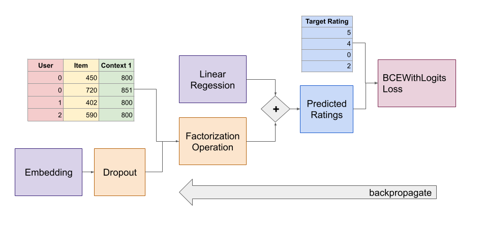
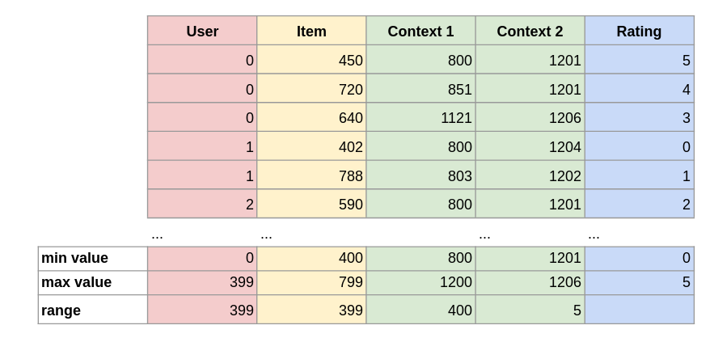
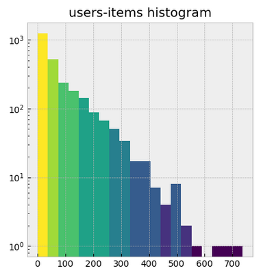
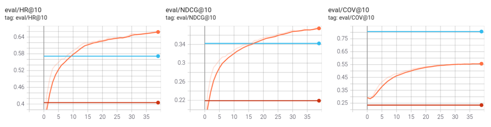
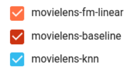
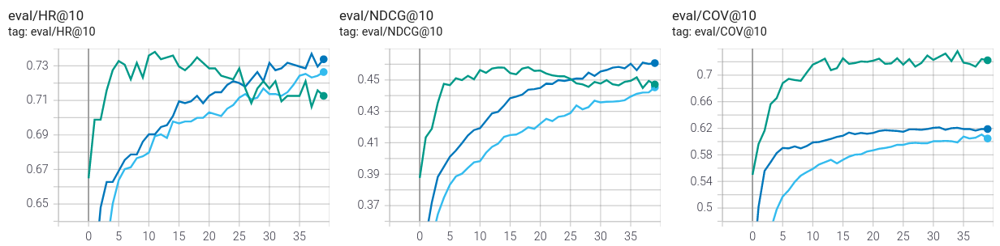
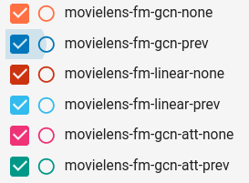
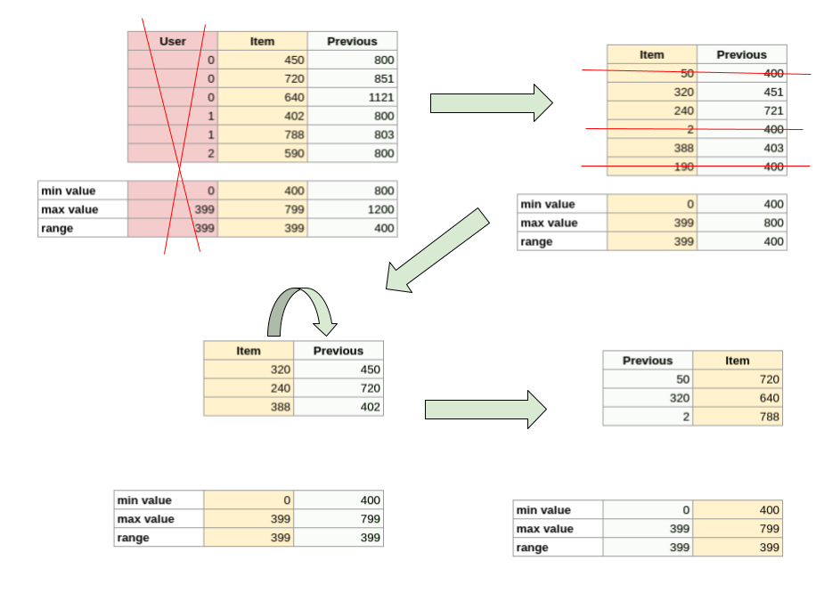
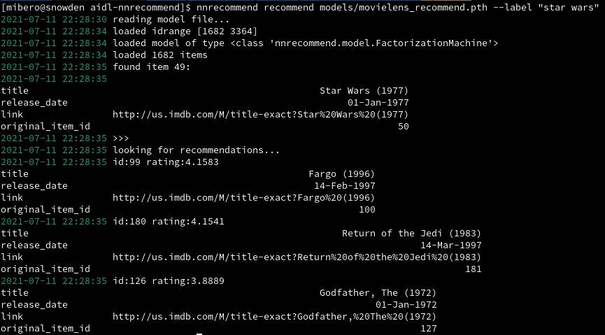

Recommendation System
====

Final Project for the UPC Artificial Intelligence with Deep Learning Postgraduate Course, Spring 2021.

* Authors: [Abel Martínez](mailto:abelmart@gmail.com), [Rafael Pérez](rrafaelapm93@gmail.com), [Miguel Ibero](mailto:miguel@ibero.me)
* Team Advisor: [Paula Gomez Duran](paulagomezduran@gmail.com)
* Date: July 2021

## Table of Contents 

* [Introduction](#intro)
* [Overview](#overview)
  * [Setup & Usage](#setup_usage)
  * [Architecture](#architecture)
    * [Model](#architecture_model)
    * [Dataset](#architecture_dataset)
    * [Operations](#architecture_operations)
    * [HyperParameters](#architecture_hparams)
* [Experiments](#experiments)
  * [Movielens Dataset](#experiments_movielens)
  * [Spotify Dataset](#experiments_spotify)
  * [Addressing The Cold Start Problem](#experiments_coldstart)
* [Conclusions](#conclusions)
* [Future Work](#future_work)
* [Bibliography](#bibliography)

# Introduction <a name="intro"></a>

The goal of this project is to develop a state-of-the art collaborative filtering recommender system using machine learning that can be trained on multiple datasets. Collaborative filtering is the method used by tech companies like Amazon and Netflix for their recommender systems as it can be trained without having user & item metadata.

Factorization machines were proposed in [this 2010 paper](https://www.csie.ntu.edu.tw/~b97053/paper/Rendle2010FM.pdf) as a way of doing matrix factorization that improves
on the classic single value decomposition models by being more optimized for sparse datasets and supporting additional interaction context, these characteristics make this model ideal for recommender systems. In addition to that, we also want to evaluate [this paper](https://arxiv.org/pdf/1609.02907.pdf) that proposes replacing the factorization machine embedding with a graph convolutional network.

# Overview <a name="overview"></a>

## Setup & Usage <a name="setup"></a>

The whole project is implemented as a command-line tool. We provide the following commands:

* `nnrecommend train` train a model on a dataset
* `nnrecommend fit` fit a dataset using [surprise](https://surpriselib.com/) algorithms
* `nnrecommend tune` tune model hyperparameters using [ray tune](https://docs.ray.io/en/master/tune/index.html)
* `nnrecommend explore-dataset` show information about a dataset
* `nnrecommend recommend` load a trained model to get recommendations

Please find the tool setup and usage instructions [in this separate file](./USAGE.md).

## Architecture <a name="architecture"></a>

### Model <a name="architecture_model"></a>

Our model classes can be found in the [`nnrecommend.model`](./nnrecommend/model.py) namespace. The `FactorizationMachine` equation is split in two classes; `LinearFeatures` implements the linear regression part of the equation, while `FactorizationMachineOperation` implements the square of sum minus sum of squares part. The embeddings can be of three types, using the normal `torch.nn.Embedding` for linear embeddings, using `GraphEmbedding` which internally uses `torch_geometric.nn.GCNConv`, and using `GraphAttentionEmbedding` which internally uses `torch_geometric.nn.GATConv`. Over the embedding module we added a dropout to prevent the model from overfitting. 



We implemented the Binary Personalized Ranking loss
as explained in [this paper](https://arxiv.org/pdf/1205.2618.pdf) in the `BPRLoss` class.

Since we wanted to evaluate this new model against existing recommender system models, we implemented adapters to the different algorithms supported by the scipy [`surprise`](https://surpriselib.com/) library. These can be found in the [`nnrecommend.algo`](./nnrecommend/algo.py) namespace.

### Dataset <a name="architecture_dataset"></a>

All the classes related to reading the datasets for the different types of data can be found in the [`nnrecommend.dataset`](./nnrecommend/dataset/__init__.py) namespace.

`InteractionDataset` is the main dataset class used in the tool. It takes care of dealing with
a two dimensional numpy array of interactions where every column is formed by consecutive ids. To guarantee its correct behavior, we wrote some unit tests for it that can be found in the `test_dataset.py` file.



The `InteractionPairDataset` class allows the system to train de model with `BPRLoss` by converting the dataset into pairs of positive and negative interactions.


The `GroupingDataset` class is used in the testset to make the trainloader (set with `batch=1`) return the interaction groups for the same user.

Since we want to be able to load different dataset sources, each one needs to implement `BaseDatasetSource`,
this class will setup the basic dataset logic like removing low interactions, adding previous item context, extracting the testset interactions, etc... This is currently implemented for the movielens, spotify & podcasts datasets. Every new dataset would need to load:

* `self.trainset`: the `InteractionDataset` with the data
* `self.items`: a pandas `DataFrame` containing item metadata (used in the recommender)

### Operations <a name="architecture_operations"></a>

Since most of the commands have similar flows, we implemented them in reusable classes in the [`nnrecommend.operation`](./nnrecommend/operation.py) namespace.

The `Setup` class takes the `nnrecommend.dataset.BaseDatasetSource` and configures the negative sampling based on the provided hyperparameters.

The `Trainer` class contains the core training logic, it supports both pairwise datasets and normal ones.

The `Tester` class is used to obtain the evaluation metrics from a model or algorithm. It supports the following:
* Hit Ratio (HR): Measures whether the real test item is in the top positions of the recommendation list
* Normalized Discounted Cumulative Gain (NDCG): Measures the ranking quality which gives information about where in the raking is our real test item.
* Coverage (COV): Measures the amount of total items in the topk positions.

The `RunTracker` class sends the training & testing metrics to tensorboard and could be extended to send them to other systems.

The `Finder` uses the [`fuzzywuzzy`](https://github.com/seatgeek/fuzzywuzzy) fuzzy string matching library to find for items in a pandas `DataFrame` that mach a given string. This is used in the `recommend` subcommand to look for items without having to remember their ids.

The `Recommender` class is used in the `recommend` subcommand to generate a dataset to get item recommendations running it through a pretrained model.

### Hyperparameters <a name="architecture_hyperparameters"></a>

We created a `nnrecommend.hparams.HyperParameters` class that can load hyperparameters from the command line or from files.
Hyperparameters can be specified using `--hparam name:value` from the command line.

To load the ray tune config when running hyperparameter tuning, we also provide a way of specifying the hyperparameter ranges using json files. This allows us to tune with different values and not have to change the code every time.

For more information on the specific json formats, please read the [usage information section](./USAGE.md#hyperparameters) on hyperparameters.

# Experiments <a name="experiments"></a>

## Movielens Evaluation <a name="experiments_movielens"></a>

The movielens dataset consists of 100k interactions between 943 users and 1682 movies.



We found [this 2019 paper](https://arxiv.org/pdf/1909.06627v1.pdf) that lists evaluation metrics for different recommender systems using this dataset. The best two models listed are NeuACF and NeuACF++.

| model | hit ratio | ndcg |
| -- | --- | --- |
| ItemKNN | 0.5891 | 0.3283 |
| NeuACF | 0.6846 | 0.4068 |
| NeuACF++ | 0.6915 | 0.4092 |

Our hypothesis is that we should be able to reproduce similar metrics and hopefully improve them using factorization machines with GCN. We run our models matching the hyperparameters specified in the paper to be able to compare their results with ours.
You can download the dataset from [this link](https://www.kaggle.com/prajitdatta/movielens-100k-dataset/) and place it under the `ml-100k` folder. 

| hparam | value |
| --- | --- |
| `embed_dim` | 64 |
| `negatives_train` | 10 |
| `negatives_test` | 99 |
| `topk` | 10 |

Initial evaluation running with `fm-linear` shows that we're already better than knn, but still not better than NeuACF or NeuACF++.

```bash
nnrecommend --hparams-file hparams/movielens/initial_hparams.json train ml-100k --dataset movielens --model fm-linear --tensorboard tensorboard
nnrecomment --hparams-file hparams/movielens/initial_hparams.json fit ml-100k --dataset movielens --algorithm knn --tensorboard tensorboard
```





We enabled `pairwise_loss` (Binary Personalized Ranking loss) and added previous item context we achieve better results.
Then we optimized the model parameters using the `nnrecommend tune` command.

```bash
nnrecommend -v tune ml-100k --dataset movielens --config hparams/movielens/tune_config.json --model fm-linear
nnrecommend -v tune ml-100k --dataset movielens --config hparams/movielens/tune_config.json --model fm-gcn 
```

The tuned parameters for the training were:

for `fm-linear`:
| parameter | value |
| --- | --- |
| `learning_rate`| 0.0005 |
| `batch_size` | 1024 |
| `embed_dropout`| 0.5 |

for `fm-gcn`:
| parameter | value |
| --- | --- |
| `learning_rate`| 0.001 |
| `batch_size` | 1024 |
| `embed_dropout`| 0.4 |

The json files to load the hyperparameters can be found in the [`hparams/movielens`](./hparams/movielens) repository folder,
the resulting tensorboard data is in the [`results/movielens`](./results/movielens) folder.

To obtain the final evaluations we ran the following commands.

```bash
nnrecommend --hparams-file hparams/movielens/linear_testset_hparams.json train ml-100k --dataset movielens --model fm-linear --tensorboard tensorboard
nnrecommend --hparams-file hparams/movielens/gcn_testset_hparams.json train ml-100k --dataset movielens --model fm-gcn --tensorboard tensorboard
nnrecommend --hparams-file hparams/movielens/gcn_testset_hparams.json train ml-100k --dataset movielens --model fm-gcn-att --tensorboard tensorboard
```

comparing `fm-linear`, `fm-gcn` and `fm-gcn-att` without context


comparing `fm-linear`, `fm-gcn` and `fm-gcn-att` with previous item context




We can observe that:
* our baseline & knn metrics match more or less with the paper
* our fm-linear matches with the paper FMG
* GCN has better results than linear
* GCN with attention has better results than GCN in terms of coverage
* adding previous item context improves the metrics

| type | model | context | hit ratio | ndcg | coverage |
| --- | -- | --- | --- | --- | --- |
| paper | ItemPop | | 0.3998 | 0.3998 |
| nnrecommend | baseline |  | 0.4051 | 0.4051 | 0.2348 |
| paper | ItemKNN | | 0.5891 | 0.3283 |
| nnrecommend | knn |  | 0.5716 | 0.3422 | 0.8062 |
| paper | FMG | | 0.6373 | 0.3588 | |
| nnrecommend | fm-linear | | 0.6458 | 0.3658 | 0.5458 |
| nnrecommend | fm-gcn | | 0.6543 | 0.3792 | 0.5856 |
| nnrecommend | fm-gcn-att | | 0.6596 | 0.3883 | 0.6225 |
| paper | NeuACF | | 0.6846 | 0.4068 | |
| paper | NeuACF++ | | 0.6915 | 0.4092 | |
| nnrecommend | fm-linear | prev | 0.7264 | 0.4453 | 0.6046 |
| nnrecommend | fm-gcn | prev | **0.7370** | **0.4611** | 0.6165 |
| nnrecommend | fm-gcn-att | prev | **0.7349** | **0.4581** | **0.7206** |


If we store the trained model using the `--output` parameter, we then can run `nnrecommend recommend` to obtain new movie recommendations for the users. 

As an example, for the user `600` we can run:

```bash
nnrecommend --hparams-file hparams/movielens/linear_best_hparams.json train ml-100k --dataset movielens --model fm-linear --output movielens.pth
nnrecommend recommend movielens.pth --label 600 --user-items 3
``` 

Result would be:

```
user 600 rated 148 movies
some movies that the user rated were:
The Godfather (1972)
Strange Days (1995)
Sneakers (1992)
----
highest recommended movies for the user:
The Fugitive (1993)
Toy Story (1995)
When Harry Met Sally... (1989)
```

To achieve this what we're doing in the `Recommender` class is we generate a dataset with the specified user in the user column and all the items in the item column and run it through the pretrained model. Highest predicted ratings are the top recommended movies.

## Spotify Evaluation <a name="experiments_spotify"></a>

Now that we see that our models improved the results of the paper in the movielens dataset, we will try them out on another dataset, spotify sessions and songs that were released for the sequential skip prediction challenge. The dataset can be downloaded from [here](https://www.aicrowd.com/challenges/spotify-sequential-skip-prediction-challenge).

Our hypothesis is that we can train our models on this data and obtain similar results to the movielens ones. In addition to this, since the dataset includes a lot of metadata, we want to add other context rows and evaluate if those improve the metrics.

Initially we downloaded the mini training set from aircrowd page. It consist in 10.000 randomly chosen sessions. At first we worked with it, but results were worse than movilens using GCN algorithm. After checking the results, we reached the conclusion that the random data set didn't have a similar distribution to the full dataset, so the results were bad. Working with complete dataset, who is 1000M records and 56Gb of compressed data, is non-viable due to our computation resources, so we built a new mini dataset with a histogram more similar to the real one and with a size that is much more workable. You can download it from [here](./results/spotify/mini-spotify-data.csv).

New constructed dataset is so good that results are very good for linear and then GCN does not improve much than linear. 

We tried previous song as context data and it works fine, like in movilens. Then we tried to use skipped songs as bad rating data and not skipped songs as good rating but those experiments did not improve the results.

## Addressing The Cold Start Problem <a name="experiments_coldstart"></a>

We found that our models we're able to generate recommendations for existing users, but since this is a collaborative filtering recommender system, it suffers from the cold start problem, i.e. it cannot recommend items to users that are not in the dataset.

To address this issue we propose a modification of the `InteractionDataset` that goes as follows:
* remove the `user` column
* compute previous item context column
* remove all the rows with -1 previous item (no previous item)
* switch the item column with the previous item context column



With this change we have a dataset where given a previous item, the factorization machine should return a rating for the next item. Our hypothesis is that we can use this modified dataset to train the same factorization machine model to recommend an item to new users that only need to provide 1 item they like. 

To evaluate this hypothesis we can use the same metrics as in the normal factorization machine, we will just group by previous item instead of by user. That said, to test the trained model and obtain some sample recommendations, it would be best to have dataset that contains item metadata. Therefore we will test with the movielens dataset, since the spotify one does not contain song names.

We train a model using the `recommend` hyperparameter to enable this new functionality.

```
nrecommend --hparam recommend:1 --hparam interaction_context: train data/ml-100k --dataset movielens --output movielens_recommend.pth
```

As we can see, the recommender evaluation metrics are improving, that means that we're correctly training the model.
And then we can use the `nnrecommend recommend` command to get recommendations for movies.

```
nnrecommend recommend movielens_recommend.pth --label "star wars"
```



When asking for recommendations similar to `Star Wars` we're getting `Return Of The Jedi` as the second highest ranked, seems like a good recommendation.

# Conclusions <a name="conclusions"></a>

We managed to reproduce the recommender system metrics shown in [this 2019 paper](https://arxiv.org/pdf/1909.06627v1.pdf) using the movielens dataset.

We managed to extract a subset of the spotify dataset that could be used to train recommender systems and obtained good results.

We implemented Bayesian Personalized Ranking loss, Graph Convolutional Network Embeddings and previous item context and showed that they improve the factorization machine evaluation metrics. 

We showed that using Graph Convolutional Networks for the embedding of a factorization machine can lead to better results in some cases.

We proposed a solution that adapts the factorization machine model to deal with the cold start problem.

# Future Work <a name="future_work"></a>

To get better results we could implement the neural version of the factorization machine as explained in [this paper](http://staff.ustc.edu.cn/~hexn/papers/sigir17-nfm.pdf).

The current model could be extended to add user & item features in the graph convolutional network,
right now the features matrix that can be provided to the GCN is always an identity.

The item recommendation algorithm could be extended to add multiple previous item colums and then 
the item recommendation could be more accurate if a new user provides multiple items they liked.

We could evaluate adding other interaction contexts that can be found in the spotify dataset and see how they affect the different models.

We could implement a frontend for the `recommend` subcommand to get recommendations via web, for example using the [flask](https://flask.palletsprojects.com/en/2.0.x/) framework.

# Bibliography <a name="bibliography"></a>

* papers
  * [Factorization Machines](https://www.csie.ntu.edu.tw/~b97053/paper/Rendle2010FM.pdf)
  * [Semi-supervised classification with Graph Convolutional Networks](https://arxiv.org/pdf/1609.02907.pdf)
  * [Bayesian Personalized Ranking from Implicit Feedback](https://arxiv.org/pdf/1205.2618.pdf)
  * [Deep Collaborative Filtering with Multi-Aspect Information in Heterogeneous Networks](https://arxiv.org/pdf/1909.06627v1.pdf)
  * [Graph Convolutional Embeddings for Recommender Systems](https://arxiv.org/pdf/2103.03587.pdf)
* Datasets
  * [Movielens100k Dataset](https://grouplens.org/datasets/movielens/100k/)
  * [Spotify Skip Challenge Dataset](https://www.aicrowd.com/challenges/spotify-sequential-skip-prediction-challenge)
  * [iTunes Podcasts Dataset](https://www.kaggle.com/thoughtvector/podcastreviews)
