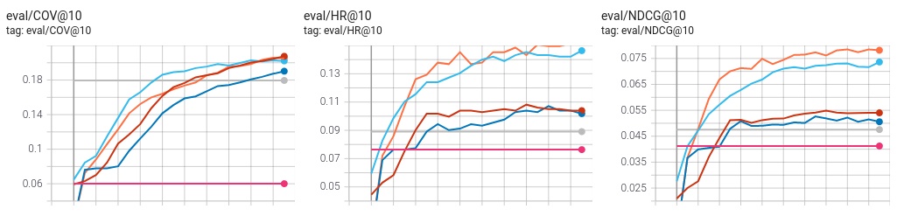
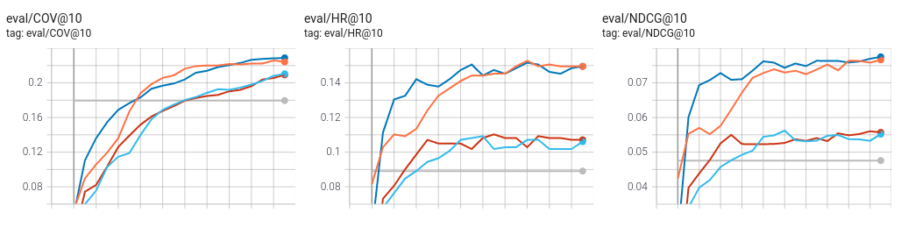
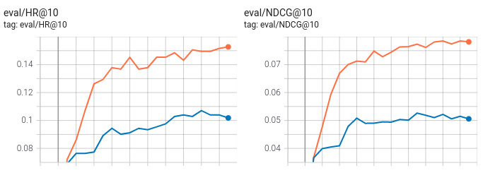
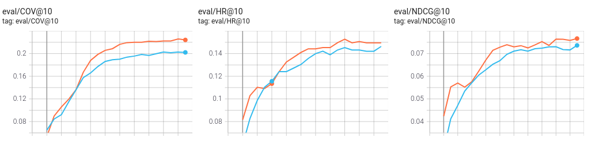
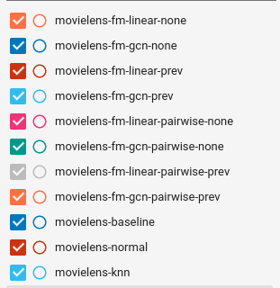

# Model Evaluation using the Movielens Dataset

We compared different models using the [movielens dataset](https://www.kaggle.com/prajitdatta/movielens-100k-dataset/). The tensorboard logdir can be downloaded from [here](./tensorboard.zip).

some conclusions for this dataset:
* adding the previous item as a context improves the metrics substantially
* using pairwise loss improves coverage a bit but is slower
* gcn is not much better than linear

comparing all the nnrecommend training with rating loss

comparing all the nnrecommend training with pairwise loss

comparing fm-linear without context with previous movie context

comparing fm-gcn rating loss with pairwise loss

### Evaluation

| type | model | context | loss | hit ratio | ndcg | coverage |
| --- | -- | --- | --- | --- | --- | --- |
| FM-Fairness | fm-linear |  | pairwise | 0.0901 | 0.0479 | 0.10
| FM-Fairness | fm-linear | prev | pairwise | 0.1389 | 0.0697 | 0.19 |
| FM-Fairness | fm-gcn |  | pairwise | 0.1050 | 0.0537 |  0.15 
| FM-Fairness | fm-gcn | prev | pairwise | 0.1389 | 0.0765 | 0.21 | 
| nnrecommend | fm-linear |  | rating | 0.1071 | 0.0526 | 0.1902 | 
| nnrecommend | fm-linear | prev | rating | 0.1527 | 0.0781 | 0.2051
| nnrecommend | fm-linear |  | pairwise | 0.1071 | 0.0557 | 0.2093
| nnrecommend | fm-linear | prev | pairwise | 0.1495 | 0.0775 | 0.2289
| nnrecommend | fm-gcn |  | rating | 0.1039 | 0.0540 | 0.2075
| nnrecommend | fm-gcn | prev | rating | 0.1463 | 0.0736 | 0.2021
| nnrecommend | fm-gcn |  | pairwise | 0.1060 | 0.0552 | 0.2105
| nnrecommend | fm-gcn | prev | pairwise | 0.1495 | 0.0766 | 0.2241
| nnrecommend | knn |  |  | 0.0891 | 0.0476 | 0.1795

### Hyperparameters

| name | value |
| --- | --- |
| negatives_train | 4 |
| negatives_test | -1 |
| batch_size | 1024 |
| epochs | 20 |
| embed_dim | 64 |
| learning_rate | 0.001 |
| dropout | 0.5 |
