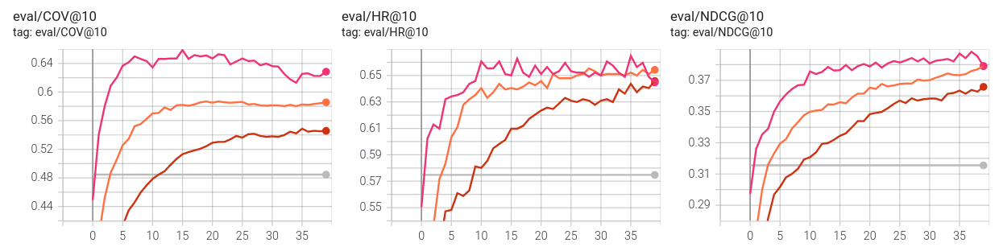
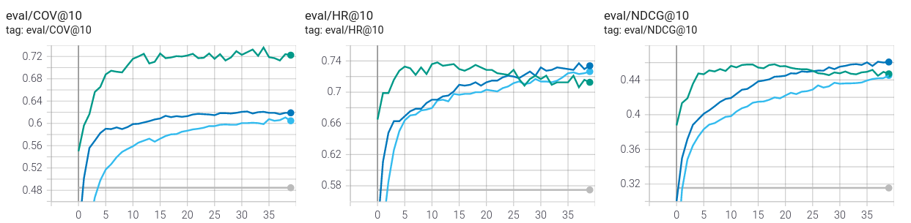

# Model Evaluation using the Movielens Dataset

We compared different models using the [movielens dataset](https://www.kaggle.com/prajitdatta/movielens-100k-dataset/). The tensorboard logdir can be downloaded from [here](./tensorboard.zip).

We're running our model using 10 negative samples in the trainset and with [BPR loss](https://arxiv.org/pdf/1205.2618.pdf). We're evaluating with topk==10 and 99 negative samples in the testset to be able to compare
our results with the ones presented in [this paper](https://arxiv.org/pdf/1909.06627v1.pdf).

comparing fm-linear, fm-gcn and fm-gcn-att without context

comparing fm-linear, fm-gcn and fm-gcn-att with previous item context

| type | model | context | hit ratio | ndcg | coverage |
| --- | -- | --- | --- | --- | --- |
| paper | ItemKNN | | 0.5891 | 0.3283 |
| paper | NeuACF++ | | 0.6915 | 0.4092 | |
| paper | NeuACF | | 0.6846 | 0.4068 | |
| nnrecommend | fm-linear | | 0.6458 | 0.3658 | 0.5458
| nnrecommend | fm-linear | prev | 0.7264 | 0.4453 | 0.6046
| nnrecommend | fm-gcn | | 0.6543 | 0.3792 | 0.5856 |
| nnrecommend | fm-gcn | prev | 0.7370 | 0.4611 | 0.6165 |
| nnrecommend | fm-gcn-att | | 0.6596 | 0.3883 | 0.6225 |
| nnrecommend | fm-gcn-att | prev | 0.7349 | 0.4581 | 0.7206 |
| nnrecommend | knn |  | 0.5748 | 0.3155 | 0.4845