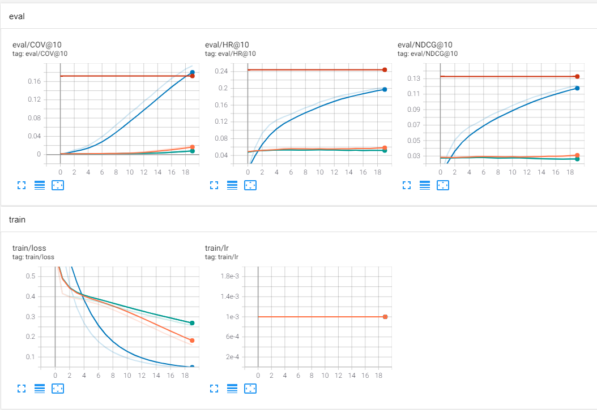
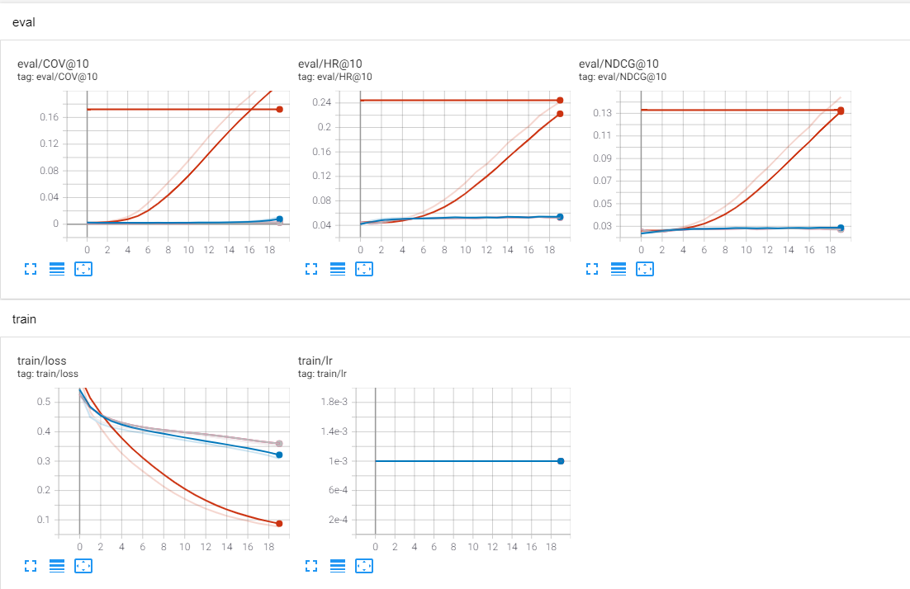
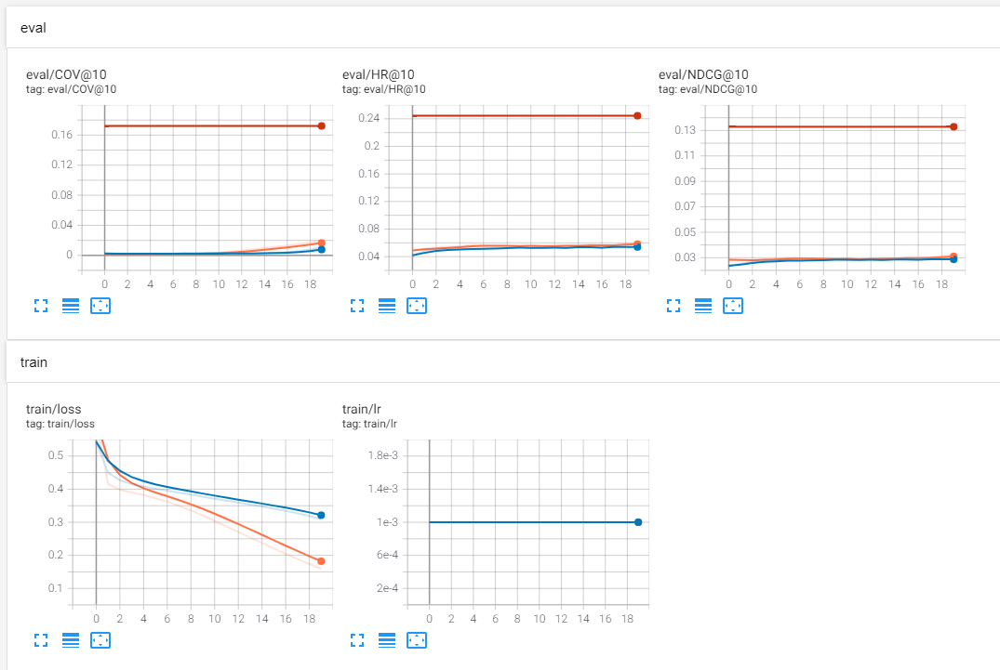
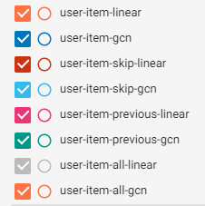

# Model Evaluation using the Spotify Dataset
We compared different models using the [Spotify Skip Predition Challenge](https://www.aicrowd.com/challenges/spotify-sequential-skip-prediction-challenge-old) as Dataset. We used skip values as context data. If one user skip some song it has a bad ratio and if the song is not skipped it has a better ratio. You can download Tensorboard results [here](https://github.com/miguelibero/aidl-nnrecomend/blob/main/results/spotify/tensorboard.zip)

Some conclusions (Very similar to movilens dataset):
-   adding the previous item as a context improves the metrics substantially
-   using pairwise loss improves coverage 
-   gcn is a little better than linear

### Graphics

### Evaluation
| type | model | context | pairwise | loss | hit ratio | ndcg | coverage |
| --- | -- | --- | --- | --- | --- | --- | --- |
| nnrecommend | fm-linear | | no | 0.0431 | 0.2015 | 0.1211 | 0.1945 |
| nnrecommend | fm-gcn | | no | 0.0764 | 0.2415 | 0.1442 | 0.2295 |
| nnrecommend | fm-linear | skip| no |  0.2568 | 0.0531 | 0.0282 | 0.0022 |
| nnrecommend | fm-gcn | skip | no | 0.3535 | 0.0530 | 0.0283 | 0.0024 |
| nnrecommend | fm-linear | previous | no | 0.2568 | 0.0531 | 0.0282 | 0.0022 |
| nnrecommend | fm-gcn | previous | no | 0.3535 | 0.0530 | 0.0283 | 0.0024 |
| nnrecommend | fm-linear | all | no | 0.1594 | 0.0595 | 0.0318 | 0.0200 |
| nnrecommend | fm-gcn | all | no | 0.3085 | 0.0555 | 0.0290 | 0.0057 |
| nnrecommend | fm-linear | | yes | 0.0431 | 0.2015 | 0.1211 | 0.1945 |
| nnrecommend | fm-gcn | | yes | 0.0764 | 0.2416 | 0.1443 | 0.2296 |
| nnrecommend | fm-linear | skip | yes | 0.2568 | 0.0531 | 0.0282 | 0.0022 |
| nnrecommend | fm-gcn | skip | yes | 0.3535 | 0.0530 | 0.0283 | 0.0024 |
| nnrecommend | fm-linear | previous | yes | 0.2568 | 0.0531 | 0.0282 | 0.0022 |
| nnrecommend | fm-gcn | previous| yes |  0.3535 | 0.0530 | 0.0283 | 0.0024 |
| nnrecommend | fm-linear | all | yes | 0.1594 | 0.0595 | 0.0318 | 0.0200 |
| nnrecommend | fm-gcn | all | yes | 0.3085 | 0.0555 | 0.0290 | 0.0057 |
| nnrecommend | knn-user-item | | no | 0.3085 | 0.2444 | 0.1329 | 0.1721 |

### Hyperparameters

| name | value |
| --- | --- |
| negatives_train | 4 |
| negatives_test | -1 |
| batch_size | 1024 |
| epochs | 20 |
| embed_dim | 64 |
| learning_rate | 0.001 |
| dropout | 0.5 |

