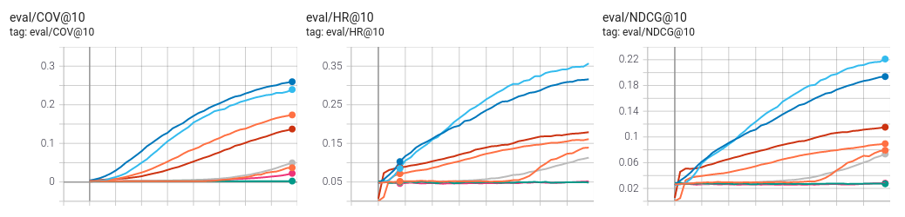
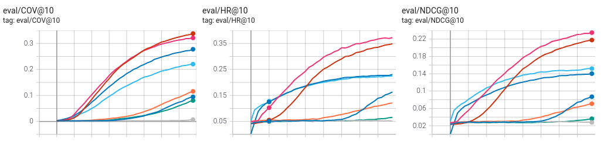

# Model Evaluation using the Spotify Dataset
We compared different models using the [Spotify Skip Predition Challenge](https://www.aicrowd.com/challenges/spotify-sequential-skip-prediction-challenge-old) as Dataset. We used skip values as context data. If one user skip some song it has a bad ratio and if the song is not skipped it has a better ratio. You can download Tensorboard results [here](https://github.com/miguelibero/aidl-nnrecomend/blob/main/results/spotify/tensorboard.zip)

Some conclusions (Very similar to movilens dataset):
*  adding the previous item as a context improves the metrics substantially
*   using pairwise loss improves the metrix 
*  gcn is better than linear
* skip context is not working (metrics are bad)

## Tensorboard Graphics

### FM - Linear (with and without context)

### FM - GCN (with and without context)

### rating loss (with and without context)

### pairwise loss (with and without context)

## Evaluation
| type | model | context | pairwise | hit ratio | ndcg | coverage |
| --- | -- | --- | --- | --- | --- | --- |
| nnrecommend | fm-linear | | no | 0.1610 | 0.0895 | 0.1737 |
| nnrecommend | fm-gcn | | no | 0.3161 | 0.1938 | 0.2597 |
| nnrecommend | fm-linear | skip| no | 0.0514 | 0.0281 | 0.0224 |
| nnrecommend | fm-gcn | skip | no | 0.0537 | 0.0289 | 0.0020 |
| nnrecommend | fm-linear | previous | no | 0.1790 | 0.1152 | 0.1372 |
| nnrecommend | fm-gcn | previous | no | 0.3571 | 0.2212 | 0.2395 |
| nnrecommend | fm-linear | all | no | 0.1130 | 0.0735 | 0.0496 |
| nnrecommend | fm-gcn | all | no | 01.1390 | 0.0792 | 0.0370 |
| nnrecommend | fm-linear | | yes | 0.2306 | 0.1403 | 0.2774 |
| nnrecommend | fm-gcn | | yes | 0.3484 | 0.2177 | 0.3378 |
| nnrecommend | fm-linear | skip | yes | 0.0657 | 0.0361 | 0.0804 |
| nnrecommend | fm-gcn | skip | yes | 0.0550 | 0.0297 | 0.0025 |
| nnrecommend | fm-linear | previous | yes | 0.2242 | 0.1520 | 0.2185 |
| nnrecommend | fm-gcn | previous| yes | 0.3722 | 0.2348 | 0.3210 |
| nnrecommend | fm-linear | all | yes | 0.1207 | 0.0709 | 0.1156 |
| nnrecommend | fm-gcn | all | yes | 0.1632 | 0.0870 | 0.0945 |
| nnrecommend | knn-user-item | | no | 0.3085 | 0.2444 | 0.1329 | 0.1721 |

## Hyperparameters

| name | value |
| --- | --- |
| negatives_train | 4 |
| negatives_test | -1 |
| batch_size | 1024 |
| epochs | 20 |
| embed_dim | 64 |
| learning_rate | 0.001 |
| dropout | 0.5 |

